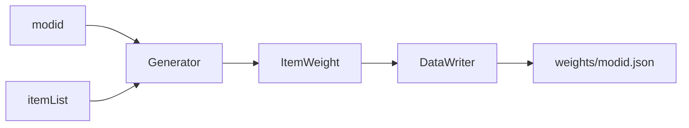

# Understanding Weight Files

Weight files are created at the end of the loader initialization to maximize compatibility with user installed mods. Mods 
that do not add items to the game will be skipped, reducing the number of files created and saving storage space.

Generated weight files can be found in the weights folder found in the root directory of the Minecraft installation. 



```admonish danger title='Do Not Change File Names'
The modid is dependent upon each mod and it cannot be changed.
```

## The File
The resulting output is compiled into a .json file and is sorted by the modid. The data put into the file is sorted 
alphabetically for legibility. 

```json
[
  {
    "acacia_boat": {
      "readable_name": "Acacia Boat",
      "weight": 1.3
    }
  }
]
```

The items registry name is used as the key when obtaining the weight, the readable_name exists solely during manual input
to search for items, and the weight value is the main value Heavy Inventories searches for.
